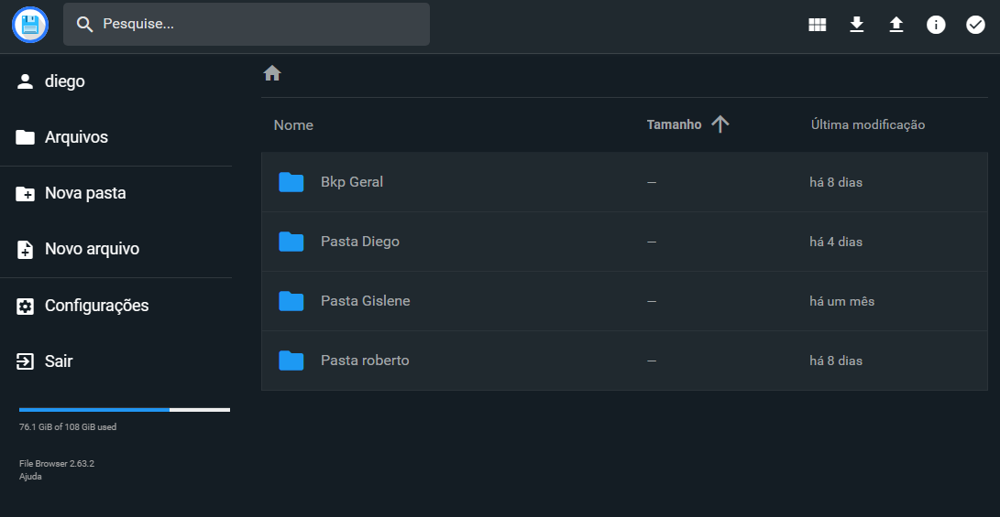
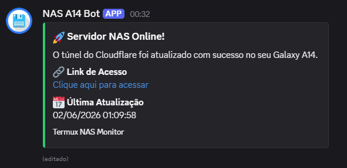

# 📱 DIY Mobile Server

<p align="center">
  
  
  
</p>

Este projeto transforma um dispositivo Android antigo em um servidor funcional com acesso remoto (SSH), gerenciador de arquivos (File Browser) e túnel de acesso externo seguro (Cloudflare), tudo automatizado via Termux e blindado contra quedas de conexão por um sistema de monitoramento dinâmico (Watchdog).

> Ideal para quem quer um NAS de baixo custo e baixo consumo de energia.

## 🚀 Funcionalidades

* **Acesso Remoto**: SSH configurado para gestão via terminal.
* **Interface Web**: File Browser para gerenciar arquivos do celular pelo navegador de qualquer lugar.
* **Acesso Externo**: Túnel Cloudflare para acessar o servidor sem abrir portas no roteador.
* **Notificação Inteligente**: Envio automatizado da URL para um canal do Discord via Webhook, com **auto-edição da mesma mensagem** para evitar poluição do chat.
* **Configuração Segura**: Uso de variáveis de ambiente através de arquivo `.env`, evitando exposição de credenciais diretamente nos scripts.
* **Auto-start**: Inicialização automática dos serviços ao ligar o celular através do Termux:Boot.
* **Resiliência (Watchdog)**: Monitoramento em segundo plano (via Cron) que detecta quedas do túnel e restabelece a conexão sem intervenção manual.

---

## 📸 Preview

|<br><sub>Interface do File Browser</sub> | <br><sub>Notificação Dinâmica no Discord</sub>|
| :---: | :---: |

---

## 📦 1. Pré-requisitos

Instale os seguintes aplicativos no seu Android (preferencialmente via F-Droid):

1. **Termux**: O terminal principal.
2. **Termux:Boot**: Necessário para iniciar os scripts automaticamente no boot do sistema.
3. **Termux:API**: Utilizado pelo script para gerenciar o estado de suspensão do aparelho (`termux-wake-lock`).

> **Importante:** Desative a otimização de bateria para o Termux e para o Termux:Boot nas configurações do Android para evitar que o sistema encerre o servidor em segundo plano.

---

## ⚙️ 2. Preparação Inicial

Abra o Termux e execute os comandos abaixo para atualizar o sistema e instalar todas as dependências necessárias:

```bash
pkg update && pkg upgrade -y
pkg install git curl nano openssh netcat-openbsd cloudflared cronie termux-api -y
```

### Habilitar Armazenamento

Para que o servidor consiga acessar os arquivos internos do celular:

```bash
termux-setup-storage
```

Aceite a permissão de acesso aos arquivos quando solicitada pelo Android.

---

## 🔐 3. Configuração do SSH

### Definir senha do usuário

```bash
passwd
```

### Descobrir o nome do usuário

```bash
whoami
```

### Conectar via SSH

O servidor SSH roda na porta `8022`.

```bash
ssh [seu_usuario]@[IP_DO_CELULAR] -p 8022
```

---

## 📁 4. Instalação do File Browser

Instale o File Browser utilizando o script oficial:

```bash
curl -fsSL https://raw.githubusercontent.com/filebrowser/get/master/get.sh | bash
```

---

## 🔐 5. Configuração das Variáveis de Ambiente

O sistema utiliza um arquivo `.env` para armazenar configurações sensíveis, como o Webhook do Discord.

### Criar o arquivo `.env`

```bash
nano ~/.env
```

Adicione o seguinte conteúdo:

```env
DISCORD_WEBHOOK_URL=https://discord.com/api/webhooks/SEU_WEBHOOK
```

Exemplo:

```env
DISCORD_WEBHOOK_URL=https://discord.com/api/webhooks/123456789012345678/abcdefghijklmnopqrstuvwxyz
```

### Localização do arquivo

O script principal procura automaticamente pelo arquivo:

```text
/data/data/com.termux/files/home/.env
```

ou simplesmente:

```text
~/.env
```

### Verificar se o arquivo existe

```bash
ls -lha ~/.env
```

### Testar o carregamento

```bash
source ~/.env
echo $DISCORD_WEBHOOK_URL
```

Se a URL aparecer no terminal, a configuração está correta.

> **Importante:** Nunca publique o arquivo `.env` em repositórios GitHub.

---

## 🚀 6. Automação e Script Principal

### Criar diretório do Termux:Boot

```bash
mkdir -p ~/.termux/boot
```

### Criar o script principal

```bash
nano ~/.termux/boot/start-services.sh
```

Cole o conteúdo completo do script principal.

### Permissão de execução

```bash
chmod +x ~/.termux/boot/start-services.sh
```

### Funcionamento do Script

O script realiza automaticamente:

* Carregamento das variáveis do arquivo `.env`
* Inicialização do serviço Cron (`crond`)
* Aplicação do `termux-wake-lock`
* Inicialização do SSH
* Inicialização do File Browser
* Criação do túnel Cloudflare
* Captura da URL pública gerada
* Envio ou atualização da mensagem no Discord
* Registro de logs para auditoria e diagnóstico

---

## ⚡ Atalhos (Aliases)

Adicione ao arquivo `~/.bashrc`:

```bash
# Ver URL atual do Cloudflare
alias cf='cat ~/URL_ATUAL.txt'

# Reiniciar manualmente todo o ambiente
alias restartenv='bash ~/.termux/boot/start-services.sh'
```

Aplicar alterações:

```bash
source ~/.bashrc
```

---

## 🐕 7. Configuração do Watchdog (Anti-Queda)

Como o túnel gratuito do Cloudflare gera URLs temporárias, configuramos um monitor automático.

### Criar o script

```bash
nano ~/ping_nas.sh
```

### Conteúdo do script

```bash
#!/data/data/com.termux/files/usr/bin/bash

if ! pkill -0 -f cloudflared; then
    echo "Cloudflare caiu em: $(date). Reiniciando serviços..." >> ~/WATCHDOG.txt
    bash ~/.termux/boot/start-services.sh
fi
```

### Permissão de execução

```bash
chmod +x ~/ping_nas.sh
```

### Configurar Cron

Abra o editor:

```bash
crontab -e
```

Adicione:

```text
*/5 * * * * bash ~/ping_nas.sh
```

O sistema verificará a cada 5 minutos se o Cloudflare Tunnel continua ativo.

---

## 📂 Estrutura de Arquivos

| Arquivo                            | Função                            |
| ---------------------------------- | --------------------------------- |
| `~/.env`                           | Variáveis de ambiente             |
| `~/URL_ATUAL.txt`                  | Última URL pública gerada         |
| `~/MSG_ID.txt`                     | ID da mensagem enviada ao Discord |
| `~/BOOT_OK.txt`                    | Histórico de inicializações       |
| `~/WATCHDOG.txt`                   | Histórico de reinicializações     |
| `~/cloudflared.log`                | Log do Cloudflare Tunnel          |
| `~/filebrowser.log`                | Log do File Browser               |
| `~/ping_nas.sh`                    | Script do Watchdog                |
| `~/.termux/boot/start-services.sh` | Script principal                  |

---

## 🛠 8. Estrutura do Sistema

| Serviço / Script      | Tipo          | Função                                 |
| --------------------- | ------------- | -------------------------------------- |
| **SSHD**              | Serviço       | Acesso remoto via terminal (`8022`)    |
| **File Browser**      | Interface Web | Gerenciador de arquivos (`8080`)       |
| **Cloudflared**       | Túnel         | Exposição pública segura               |
| **crond**             | Serviço       | Agendador de tarefas                   |
| **start-services.sh** | Script        | Inicialização completa do ambiente     |
| **ping_nas.sh**       | Script        | Monitoramento e recuperação automática |

---

## 🔍 9. Como Usar

### Acesso Local (Mesma Rede)

#### File Browser

```text
http://[IP_DO_CELULAR]:8080
```

#### SSH

```bash
ssh [usuario]@[IP_DO_CELULAR] -p 8022
```

### Acesso Externo

Sempre que:

* O celular for reiniciado;
* A conexão Wi-Fi cair;
* O túnel Cloudflare for recriado;

o sistema:

1. Obtém uma nova URL pública.
2. Atualiza automaticamente a mensagem existente no Discord.
3. Salva a URL localmente em:

```text
~/URL_ATUAL.txt
```

ou através do comando:

```bash
cf
```

---

## ⚠️ Regras e Avisos

### Limpeza Automática

Antes de iniciar novas instâncias, o sistema encerra processos antigos para evitar:

* Conflitos de porta.
* Múltiplos túneis Cloudflare.
* Múltiplas instâncias do File Browser.

### Proteção Contra Loops

O script verifica se o serviço `crond` já está em execução antes de iniciá-lo novamente.

### Persistência do Discord

O arquivo:

```text
~/MSG_ID.txt
```

armazena o ID da mensagem enviada ao Discord.

Caso a mensagem seja removida manualmente, o sistema detectará automaticamente e criará uma nova mensagem válida.

### Segurança

* Nunca publique o arquivo `.env`.
* Nunca compartilhe o Webhook do Discord.
* Evite utilizar redes Wi-Fi públicas sem proteção adequada.
* Considere restringir acesso ao File Browser com autenticação forte.

---

## 🏗 Arquitetura Final do Sistema


**Resultado:** um servidor Android de baixo custo, com acesso remoto, interface web, túnel seguro, inicialização automática e recuperação autônoma de falhas.
