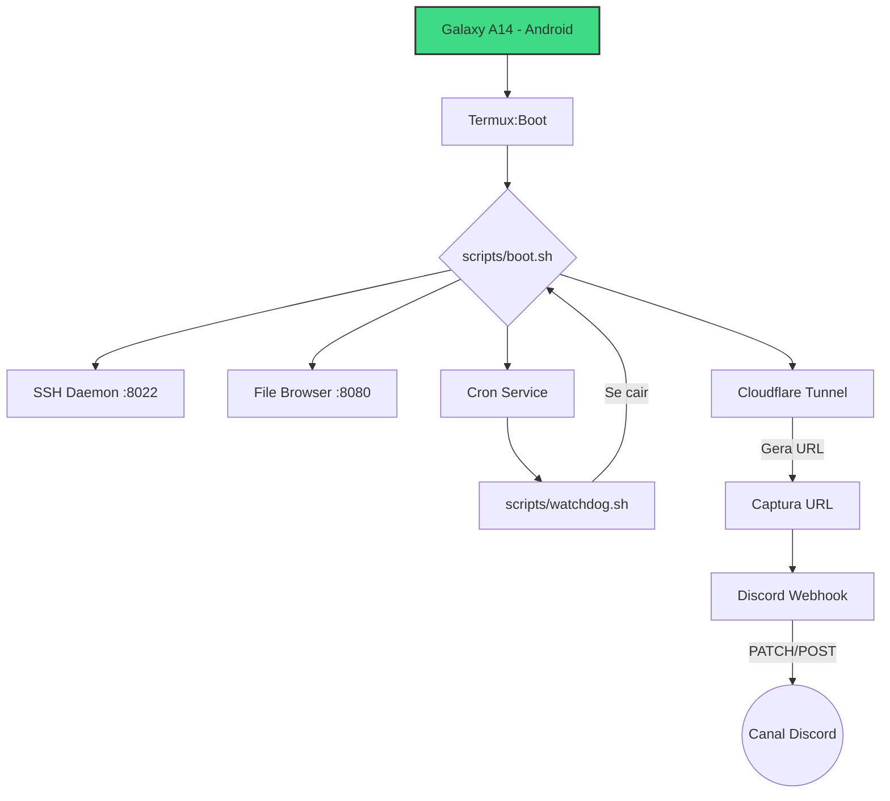

# 📱 DIY Mobile Server

<p align="center">
  
  
  
</p>

Transforme um dispositivo Android antigo em um servidor NAS funcional com acesso SSH, gerenciador de arquivos web e túnel seguro Cloudflare — tudo automatizado via Termux, com monitoramento contínuo e recuperação autônoma de falhas.

> Ideal para NAS de baixo custo, baixo consumo de energia (~5W) e reaproveitamento de hardware.

---

## ⚡ Quick Start

```bash
git clone https://github.com/diego-abuv/diy-mobile-server.git
cd diy-mobile-server
bash install.sh                    # instala deps, aliases, crontab e boot
nano ~/.env                        # cole: DISCORD_WEBHOOK_URL="seu_webhook"
termux-setup-storage               # libera acesso aos arquivos
# Reinicie o celular ou execute:
bash ~/diy-mobile-server/scripts/boot.sh
```

---

## 🚀 Funcionalidades

- **Acesso Remoto**: SSH na porta `8022` para gestão via terminal
- **Interface Web**: File Browser para gerenciar arquivos do celular pelo navegador
- **Túnel Seguro**: Cloudflare Tunnel — sem abrir portas no roteador
- **Notificação Híbrida**: Embed canônico editado (PATCH) + notificação curta (POST) a cada renovação
- **Configuração Segura**: Variáveis de ambiente via `~/.env`, fora do repositório
- **Auto-start**: Inicialização automática via Termux:Boot ao ligar o celular
- **Watchdog**: Cron monitora cloudflared, filebrowser e sshd a cada 5 min; reinicia automaticamente se algum cair

---

## 📸 Preview

|<br><sub>Interface do File Browser</sub> | <br><sub>Notificação no Discord</sub>|
| :---: | :---: |

---

## 📦 Pré-requisitos

Instale no Android (preferencialmente via F-Droid):

1. **Termux** — terminal principal
2. **Termux:Boot** — execução automática no boot
3. **Termux:API** — usado para `termux-wake-lock`

> **Importante:** Desative a otimização de bateria para Termux e Termux:Boot nas configurações do Android.

---

## 🗂 Estrutura do Projeto

| Caminho | Função |
|---|---|
| `~/.env` | Variáveis de ambiente (webhook Discord) |
| `~/diy-mobile-server/scripts/boot.sh` | Script principal de inicialização |
| `~/diy-mobile-server/scripts/watchdog.sh` | Monitor anti-queda (multi-serviço) |
| `~/diy-mobile-server/scripts/status.sh` | Dashboard de status do servidor |
| `~/diy-mobile-server/scripts/shutdown.sh` | Desliga todos os serviços |
| `~/diy-mobile-server/scripts/brute-guard.sh` | Detecta brute force e derruba o servidor |
| `~/diy-mobile-server/data/` | Dados runtime (URL atual, ID da msg, DB) |
| `~/diy-mobile-server/logs/` | Logs de boot, cloudflared, filebrowser, watchdog |
| `~/.termux/boot/boot.sh` | Ponte para o Termux:Boot chamar `boot.sh` |

---

## 🛠 Instalação Manual (sem `install.sh`)

### 1. Preparação Inicial

```bash
pkg update && pkg upgrade -y
pkg install git curl openssh netcat-openbsd cloudflared cronie termux-api -y
termux-setup-storage
```

### 2. Configuração SSH

```bash
passwd                          # define a senha
whoami                          # descobre o nome do usuário
```

Conecte-se: `ssh [usuario]@[IP_DO_CELULAR] -p 8022`

### 3. File Browser

```bash
curl -fsSL https://raw.githubusercontent.com/filebrowser/get/master/get.sh | bash
```

### 4. Variáveis de Ambiente

```bash
nano ~/.env
# Conteúdo:
# DISCORD_WEBHOOK_URL="https://discord.com/api/webhooks/SEU_WEBHOOK"
```

### 5. Script Principal

```bash
mkdir -p ~/.termux/boot
nano ~/.termux/boot/boot.sh
# Conteúdo:
#!/data/data/com.termux/files/usr/bin/bash
exec bash ~/diy-mobile-server/scripts/boot.sh

chmod +x ~/.termux/boot/boot.sh
```

### 6. Aliases

Adicione ao `~/.bashrc`:

```bash
# DIY Mobile Server
alias cf='cat ~/diy-mobile-server/data/current_url.txt'
alias derrubacf='pkill -f cloudflared >/dev/null 2>&1 || true && echo "[OK] Túnel derrubado!"'
alias startenv='echo "[INFO] Iniciando ambiente..."; bash ~/diy-mobile-server/scripts/boot.sh'
alias status='bash ~/diy-mobile-server/scripts/status.sh'
alias pingarcf='bash ~/diy-mobile-server/scripts/watchdog.sh && echo "[OK] Watchdog executado"'
alias derrubatudo='bash ~/diy-mobile-server/scripts/shutdown.sh'
```

```bash
source ~/.bashrc
```

### 7. Watchdog (Cron)

```bash
crontab -e
# Adicione:
*/5 * * * * bash ~/diy-mobile-server/scripts/watchdog.sh
```

---

## 🔍 Como Usar

### Acesso Local

| Serviço | Comando |
|---|---|
| File Browser | `http://[IP_DO_CELULAR]:8080` |
| SSH | `ssh [usuario]@[IP_DO_CELULAR] -p 8022` |

### Acesso Externo

A cada boot ou renovação do túnel, o sistema:
1. Captura a nova URL do Cloudflare
2. Edita o embed canônico no Discord (PATCH)
3. Envia notificação curta de renovação
4. Salva a URL em `~/diy-mobile-server/data/current_url.txt`

```bash
cf   # exibe a URL atual
```

---

## 🛡️ Brute Force Guard

O script `scripts/brute-guard.sh` roda a cada 1 minuto via cron e:

- Monitora o log do File Browser em busca de tentativas de login inválidas (`403`)
- Se detectar **5+ tentativas em 2 minutos**, derruba automaticamente cloudflared e filebrowser
- Envia alerta no Discord com o número de tentativas
- Respeita cooldown de 5 minutos para evitar re-triggers
- O cooldown é resetado automaticamente ao executar `startenv`

## 🛑 Gerenciamento de Serviços

### Desligar o servidor

```bash
derrubatudo
```

Remove wake-lock, para cloudflared, filebrowser, sshd e crond. Para reiniciar:

```bash
startenv
```

### Credenciais padrão (File Browser)

Na primeira execução com DB vazio, o sistema cria automaticamente:

| Campo | Valor |
|---|---|
| Usuário | `admin` |
| Senha | `diy-mobile-2026!` |

**Troque a senha no primeiro acesso** pelo painel (⚙️ → Configurações → Usuário).

### Resetar senha do File Browser

Caso perca a senha:

```bash
derrubatudo                                                                  # para o filebrowser
rm -f ~/diy-mobile-server/data/filebrowser.db                               # remove DB
startenv                                                                     # recria tudo com admin / diy-mobile-2026!
```

---

## 🐕 Watchdog

O script `scripts/watchdog.sh` verifica a cada 5 minutos via cron:

- **cloudflared** — processo vivo
- **filebrowser** — porta 8080 respondendo
- **sshd** — porta 8022 escutando

Se qualquer um falhar, reinicia automaticamente via `boot.sh`. Usa `flock` para evitar execução concorrente.

---

## ⚠️ Troubleshooting

| Problema | Causa provável | Solução |
|---|---|---|
| `termux-wake-lock: not found` | Termux:API não instalado | Instale via F-Droid |
| File Browser não sobe | Porta 8080 ocupada | `pkill -f filebrowser` e tente novamente |
| Cloudflare não gera URL | Rede instável ou rate limit | Aguarde 2 min e execute `startenv` |
| Webhook não envia | `.env` não carregado ou URL inválida | Verifique `source ~/.env && echo $DISCORD_WEBHOOK_URL` |
| Processos morrendo | Otimização de bateria ativa | Desative para Termux e Termux:Boot |

---

## 🏗 Arquitetura



---

## 🛡 Segurança

- `~/.env` nunca é versionado (incluído no `.gitignore`)
- Nunca compartilhe o webhook do Discord
- Evite redes Wi-Fi públicas sem proteção
- Considere autenticação forte no File Browser

---

## 🤝 Contribuição

Contribuições são bem-vindas! Faça um fork, crie uma branch, implemente sua melhoria e abra um Pull Request.

---

*DIY Mobile Server — Transforme seu Android antigo em um NAS confiável.*
